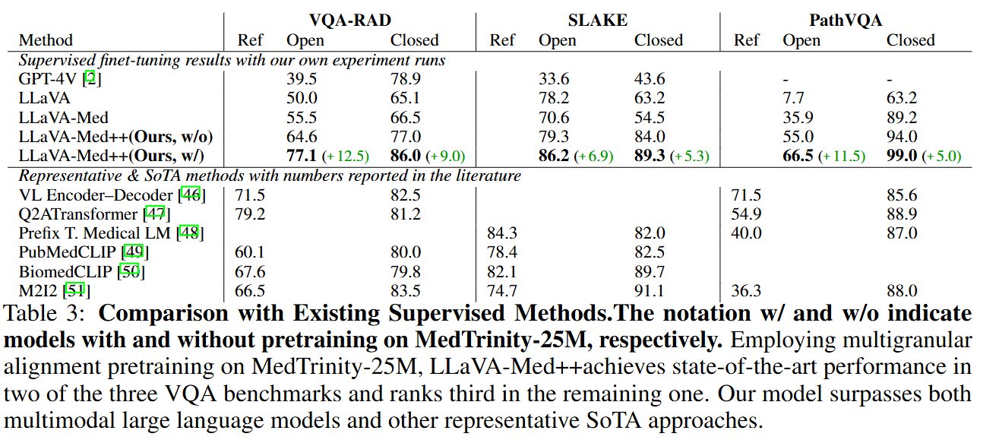

# <div align="center"> MedTrinity-25M: A Large-scale Multimodal Dataset with Multigranular Annotations for Medicine <div>

<div align="center">
  <a href="https://github.com/UCSC-VLAA/MedTrinity-25M"></a>  
  <a href="https://www.haqtu.me/Recap-Datacomp-1B"></a>  
  <a href="https://huggingface.co/datasets/UCSC-VLAA/MedTrinity-25M"></a>  
  <a href="https://arxiv.org/abs/2406.08478"></a>  
</div>

---

> [**MedTrinity-25M: A Large-scale Multimodal Dataset with Multigranular Annotations for Medicine**](https://www.haqtu.me/Recap-Datacomp-1B/)<br>
> [Yunfei Xie*](https://yunfeixie233.github.io/), [Ce Zhou*](https://github.com/Skylight-Lark),
> [Lang Gao*](https://thefllood.github.io/mudehui.github.io/), [Juncheng Wu*](https://scholar.google.com/citations?user=RSn2gykAAAAJ&hl=en),
> [Xianhang Li](https://xhl-video.github.io/xianhangli/), [Hong-Yu Zhou](https://zhouhy.org/),
> [Liu sheng](https://shengliu66.github.io/), [Lei Xing](https://profiles.stanford.edu/lei-xing),
> [James Zou](https://www.james-zou.com/),
> [Yuyin Zhou](https://yuyinzhou.github.io/),
> [Cihang Xie](https://cihangxie.github.io/)

---

## 📢 Breaking News
- [🔥October. 7, 2024.] 💥 Our arxiv paper is released. 

- [🔥October. 1, 2024.] 💥 We are excited to announce the release of MedTrinity-25M and the model fintuned on our dataset. 

Star 🌟us if you think it is helpful!!

---

## 🚀 Dataset

### Dataset construction pipeline
<p align="center">
  
</p>

1) Data processing: extracting essential information from collected data, including metadata integration to generate coarse caption, ROI locating, and medical knowledge collection. 
2) Multigranular textual description generation: using this information to prompt MLLMs to generate fine-grained captions

### Statistical overview of MedTrinity-25M

<p align="center">
  
</p>

### Dataset Download

 Dataset | 🤗 Huggingface Hub | 
| --- | ---: |
| MedTrinity-25M | [UCSC-VLAA/MedTrinity-25M](https://huggingface.co/datasets/UCSC-VLAA/MedTrinity-25M) |

---

## 🏆 Results
<p align="center">
  
</p>

---

## 💬 Quick Start


### Install

Using Linux system,

1. Clone this repository and navigate to LLaVA folder

```bash
git clone https://github.com/UCSC-VLAA/MedTrinity-25M.git
cd LLaVA
```

2. Install Package

```Shell
conda create -n llava python=3.10 -y
conda activate llava
pip install --upgrade pip  # enable PEP 660 support
pip install -e .
```

3. Install additional packages for training cases

```
pip install -e ".[train]"
pip install flash-attn --no-build-isolation
pip install git+https://github.com/bfshi/scaling_on_scales.git
pip install multimedeval
```

### Upgrade to latest code base

```Shell
git pull
pip install -e .

# if you see some import errors when you upgrade,
# please try running the command below (without #)
# pip install flash-attn --no-build-isolation --no-cache-dir
```


### 🤖 Model-Zoo

The following table provides an overview of the available models in our zoo. For each model, you can find links to its Hugging Face page. 

| Model Name                            |                             Hugging Face Link                              | Summary                                                                                                           |
|---------------------------------------|:--------------------------------------------------------------------------:|-------------------------------------------------------------------------------------------------------------------|
| LLaVA-Med-pp| [Hugging Face](https://huggingface.co/UCSC-VLAA/LLaVA-Med-pp)  | Pretrained on [LCS-558K](https://huggingface.co/datasets/liuhaotian/LLaVA-Pretrain).                              |
| LLaVA-Med-Captioner     |   [Hugging Face](https://huggingface.co/UCSC-VLAA/LLaVA-Med-Captioner)    | LoRA weights fine-tuned on [LLaVA-Instruct-665K](https://huggingface.co/datasets/liuhaotian/LLaVA-Instruct-150K). |
| MedTrinity-25M-FULL         |      [Hugging Face](https://huggingface.co/UCSC-VLAA/MedTrinity-25M-FULL/tree/main)      | Merged LoRA weights in HuggingFace format.                                                                        |


### Train and Eval LLaMA-Med-pp
First，you should download the base model [LLaVA-Meta-Llama-3-8B-Instruct-FT-S2](https://huggingface.co/MBZUAI/LLaVA-Meta-Llama-3-8B-Instruct-FT-S2) and download the stage1 and stage2 datasets in the [LLaVA-Med](https://github.com/microsoft/LLaVA-Med).
1. Pre-train
```bash
# stage1 training
cd MedTrinity-25M
bash ./scripts/med/llava3_med_stage1.sh

# stage2 training
bash ./scripts/med/llava3_med_stage2.sh
```
2. Finetune
```bash
cd MedTrinity-25M
bash ./scripts/med/llava3_med_finetune.sh
```
3. Eval
First，you should download [LLaVA-Med-pp](https://huggingface.co/UCSC-VLAA/LLaVA-Med-pp)
```bash
cd MedTrinity-25M
bash ./scripts/med/llava3_med_eval_batch_vqa_rad.sh
```

---

## 📜 Citation

If you find MedTrinity-25M useful for your research and applications, please cite using this BibTeX:

```bibtex
@article{li2023llavamed,
  title={Llava-med: Training a large language-and-vision assistant for biomedicine in one day},
  author={Li, Chunyuan and Wong, Cliff and Zhang, Sheng and Usuyama, Naoto and Liu, Haotian and Yang, Jianwei and Naumann, Tristan and Poon, Hoifung and Gao, Jianfeng},
  journal={arXiv preprint arXiv:2306.00890},
  year={2023}
}
```

---

## 🙏 Acknowledgement

- Thanks for the codebase of [LLaVA-pp](https://github.com/mbzuai-oryx/LLaVA-pp), [LLaVA-Med](https://github.com/microsoft/LLaVA-Med) and [LLaVA](https://github.com/haotian-liu/LLaVA) we built upon, and our base model [LLaVA-Meta-Llama-3-8B-Instruct-FT-S2](https://huggingface.co/MBZUAI/LLaVA-Meta-Llama-3-8B-Instruct-FT-S2) that has the amazing language capabilities!

---

## Related Projects

- [LLaVA-pp](https://github.com/mbzuai-oryx/LLaVA-pp)
- [LLaVA-Med: Training a Large Language-and-Vision Assistant for Biomedicine in One Day](https://github.com/microsoft/LLaVA-Med)
- [LLaVA](https://github.com/haotian-liu/LLaVA)
